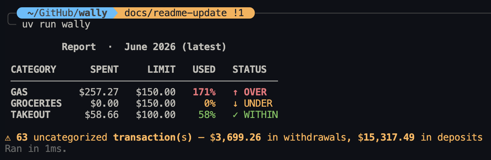

# Wally

> Know where your money went, to the penny.

Wally reads your card statements, classifies every transaction, and tells you
whether each spending category is within budget, underspending, or overspending.



## Features

- **Deterministic extraction** — coordinate-based PDF parsing via `pdfplumber`; no OCR, no LLM guessing
- **Hard correctness guarantee** — two runtime reconciliation gates abort the run if totals don't balance; a wrong report is never emitted silently
- **`Decimal` everywhere** — money is never a `float`; a rounding error that would survive float comparison will trip a gate
- **Configurable classification** — substring-match rules in a TOML file; patterns you write apply to all future statements automatically
- **Interactive annotation** — step through uncategorized transactions and grow your rules file in one session
- **Parse cache** — PDFs are parsed once and cached; subsequent runs are instant

---

## Quick start

### 1. Install

```bash
git clone https://github.com/mostfortunate/wally.git && cd wally
uv sync --extra dev
```

### 2. Set up config

```bash
uv run wally init                                      # interactive budget setup → writes wally.toml
cp classification.example.toml classification.toml     # then edit with your merchants
```

### 3. Add statements

```
statements/
  cibc/
    2026-06.pdf
  rbc/
    2026-06.pdf
```

### 4. Run

```bash
uv run wally          # auto-discovers the latest statement in each folder
```

---

## Configuration

### `wally.toml` — budget limits

Run `uv run wally init` to create this interactively, or copy from `wally.example.toml`:

```toml
[budget.limits]
groceries = "600.00"
takeout   = "100.00"
gas       = "300.00"

[statements]
dir = "statements"    # root folder; cibc/ and rbc/ subdirectories expected
```

Amounts are quoted strings on purpose — bare TOML numbers are floats and can lose a penny,
which would trip a reconciliation gate.

### `classification.toml` — transaction rules

Copy from `classification.example.toml` and add your merchants:

```toml
[categories]
takeout   = ["tim hortons", "mcdonalds", "uber eats", "doordash"]
groceries = ["save on foods", "costco", "no frills"]
gas       = ["petro", "shell", "esso"]

[exclude]
# Transfers that appear on both statements must be excluded to avoid double-counting.
"CIBC card payment" = ["payment thank you", "cibc cpd"]
```

Matching is case-insensitive substring against the transaction description. Each transaction
is classified into the first matching category, or left `UNCATEGORIZED` — never silently
dropped. Both config files are gitignored so your personal figures stay local.

---

## Usage

```
uv run wally                                           # auto-discover latest statements
uv run wally --cibc 2026-06 --rbc 2026-06             # by date stem (YYYY-MM)
uv run wally --cibc statements/cibc/2026-06.pdf       # explicit path
uv run wally --rbc 2026-06                            # one bank only

uv run wally init                                      # scaffold wally.toml interactively
uv run wally annotate --cibc 2026-06 --rbc 2026-06    # label uncategorized transactions
uv run wally annotate list                            # annotation status per statement
uv run wally cache clear                              # delete cached statement parses
```

**Flags**

| Flag | Default | Description |
|---|---|---|
| `--cibc PDF` | auto | CIBC statement path or `YYYY-MM` stem |
| `--rbc PDF` | auto | RBC statement path or `YYYY-MM` stem |
| `-c, --config PATH` | `wally.toml` | budget config |
| `-r, --rules PATH` | `classification.toml` | classification rules |
| `--statements-dir DIR` | `statements/` | root folder for auto-discovery |
| `--no-cache` | off | re-parse from PDF, skip cache |

---

## How it works

```
PDF(s)
  └─ pdfplumber (coordinate-based, amounts parsed directly to Decimal)
       ├─ CIBC: gate 1 — per-card block totals must balance
       └─ RBC:  gate 1 — statement opening/closing balance must reconcile
                    └─ classify transactions against classification.toml
                         └─ gate 2 — every transaction must land in exactly one bucket
                              └─ aggregate by category → compare to budget → rich report
```

A failed gate exits with code `2` and prints a diff showing where the numbers diverge.
No report is emitted — a wrong budget is worse than no budget.

---

## Development

```bash
uv run pytest                          # test suite
uv run ruff check --fix src/ tests/    # lint + autofix
uv run ruff format src/ tests/         # format
uv run pyright src/                    # type check
```

Each `src/` subdirectory has its own `CLAUDE.md` with the design decisions behind it. The
root `CLAUDE.md` is the full developer guide.

---

## Requirements

- Python 3.14+
- [`uv`](https://docs.astral.sh/uv/) for environment and package management
